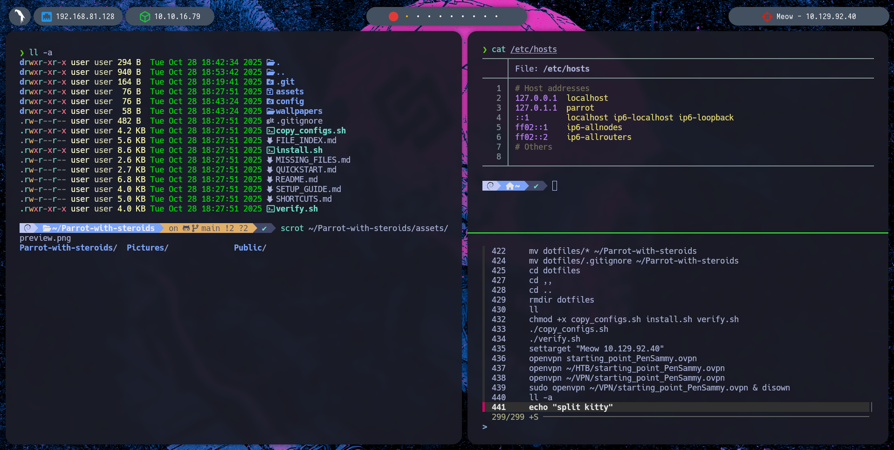

# Entorno BSPWM Pentesting para Parrot OS

Configuración completa y automatizada de un entorno de trabajo basado en BSPWM para Parrot OS, optimizado para pentesting y productividad.



## 📦 ¿Qué incluye?

| Componente | Herramienta | Descripción |
|---|---|---|
| Window Manager | **BSPWM** | Tiling WM con workspaces y reglas |
| Hotkeys | **SXHKD** | Atajos de teclado personalizados |
| Barra | **Polybar** | 5 barras flotantes (IP local, VPN HTB, target, workspaces, fecha) |
| Compositor | **Picom** | Transparencias, blur, sombras, bordes redondeados |
| Launcher | **Rofi** | Lanzador de aplicaciones con tema Dracula |
| Terminal | **Kitty** | Terminal GPU-accelerated con splits |
| Shell | **ZSH** | Con Oh-My-Zsh + Powerlevel10k + plugins |
| Lockscreen | **betterlockscreen** | Pantalla de bloqueo con blur (i3lock-color) |
| CLI | **bat, lsd, fzf** | Cat con colores, ls moderno, fuzzy finder |
| Fuente | **Hack Nerd Font** | Fuente monospace con iconos Nerd Font |
| Tema | **Dracula + Catppuccin** | Rofi: Dracula · Kitty: Catppuccin Mocha · Polybar: custom |

## 🚀 Instalación

```bash
git clone https://github.com/iHakiu/Parrot-with-steroids.git ~/Dotfiles
cd ~/Dotfiles
chmod +x install.sh
./install.sh
```

El script hace **todo automáticamente**:

- ✅ Actualiza el sistema con `parrot-upgrade` (saltable con `--skip-update`)
- ✅ Instala 40+ paquetes apt
- ✅ Compila e instala **i3lock-color** desde source
- ✅ Instala **betterlockscreen** desde GitHub
- ✅ Descarga e instala **Hack Nerd Font** (solo variante Regular)
- ✅ Instala **Kitty** via installer oficial
- ✅ Instala **Oh-My-Zsh** + plugins + **Powerlevel10k**
- ✅ Copia todas las configs a `~/` y `/root/` (entorno dual)
- ✅ Crea backups `.bak` de configs existentes
- ✅ Asigna permisos, crea symlinks, cambia shell a ZSH
- ✅ Instala `open-vm-tools-desktop` si detecta VMware
- ✅ Verificación final con reporte de estado

### Después del reinicio

1. En LightDM, seleccionar sesión **bspwm**
2. Abrir terminal (`Super + Return`) y ejecutar:
   ```bash
   betterlockscreen -u ~/.config/bspwm/wallpaper.jpg
   ```

## 📁 Estructura del Repositorio

```
Dotfiles/
├── install.sh                        ← instalador automático (el único script necesario)
├── config/                           ← refleja ~/.config/ — jerarquía = ruta destino
│   ├── bspwm/bspwmrc
│   ├── sxhkd/sxhkdrc
│   ├── kitty/kitty.conf
│   ├── picom/picom.conf
│   ├── polybar/config.ini, launch.sh
│   └── rofi/config.rasi
├── scripts/                          ← destino: ~/.config/bspwm/scripts/
│   ├── local_ip.sh                   ← IP de la interfaz principal
│   ├── htb_ip.sh                     ← IP de VPN (tun0)
│   ├── target_hack.sh               ← target actual para polybar
│   └── powermenu.sh                  ← menú apagar/reiniciar/bloquear
├── home/                             ← destino: ~/
│   ├── .zshrc                        ← config ZSH con aliases y funciones
│   └── .p10k.zsh                     ← tema Powerlevel10k
├── wallpaper/
│   └── wallpaper.jpg                 ← fondo de escritorio
└── system/
    └── bspwm.desktop                 ← sesión para LightDM (/usr/share/xsessions/)
```

## ⌨️ Atajos de Teclado Principales

| Atajo | Acción |
|---|---|
| `Super + Return` | Terminal (Kitty) |
| `Super + Shift + Return` | Terminal emergencia (xterm) |
| `Super + D` | Launcher (Rofi) |
| `Super + W` | Cerrar ventana |
| `Super + Shift + W` | Matar ventana |
| `Super + [1-9]` | Ir a workspace |
| `Super + Shift + [1-9]` | Mover ventana a workspace |
| `Super + Shift + X` | Bloquear pantalla |
| `Super + Shift + E` | Power menu |
| `Print` | Screenshot pantalla completa |
| `Super + Print` | Screenshot área seleccionada |
| `Super + Alt + R` | Reiniciar BSPWM |
| `Super + Alt + Q` | Salir de BSPWM |

📋 **[Lista completa de atajos →](SHORTCUTS.md)**

## 🛠️ Funciones ZSH para Pentesting

```bash
settarget 10.10.10.123    # Establecer target (aparece en Polybar)
cleartarget               # Limpiar target
mkt maquina_htb           # Crear estructura de directorios para CTF
extractPorts scan.xml      # Extraer puertos de nmap y copiar al clipboard
```

### Aliases incluidos

```bash
cat → batcat              # Syntax highlighting
ls → lsd                  # ls moderno con iconos
ll → lsd -la              # ls detallado
myip                      # IP pública
ports                     # Puertos abiertos
webserver                 # Python HTTP server en puerto 80
```

## 🔧 Personalización

### Cambiar wallpaper
```bash
# Reemplazar el archivo y recargar
cp nuevo_wallpaper.jpg ~/.config/bspwm/wallpaper.jpg
feh --bg-scale ~/.config/bspwm/wallpaper.jpg
betterlockscreen -u ~/.config/bspwm/wallpaper.jpg  # actualizar lockscreen
```

### Ajustar transparencias
Editar `~/.config/picom/picom.conf` — cambiar `opacity-rule` o `background_opacity` en `kitty.conf`.

### Modificar barras
Editar `~/.config/polybar/config.ini` para cambiar módulos, colores y posición.

## ⚠️ Notas Importantes

### Parrot OS
- ❌ **No usar** `apt upgrade` — puede romper el sistema
- ✅ **Usar** `parrot-upgrade`

### Máquina Virtual
Si usas VMware/VirtualBox y experimentas lag gráfico:
1. Activar **aceleración 3D** en la config de la VM
2. Asignar mínimo **128 MB de VRAM**
3. Si sigue fallando, cambiar en `~/.config/picom/picom.conf`:
   ```
   backend = "glx";  →  backend = "xrender";
   ```

## 🐛 Solución de Problemas

| Problema | Solución |
|---|---|
| Polybar no muestra módulos | `chmod +x ~/.config/bspwm/scripts/*` |
| Fuentes con cuadros | `fc-cache -fv` |
| Atajos no funcionan | `killall sxhkd && sxhkd &` |
| Pantalla negra en VM | Cambiar picom backend a `xrender` |
| Lockscreen no funciona | `betterlockscreen -u ~/.config/bspwm/wallpaper.jpg` |

## 🙏 Créditos

- [BSPWM](https://github.com/baskerville/bspwm) · [Polybar](https://github.com/polybar/polybar) · [Powerlevel10k](https://github.com/romkatv/powerlevel10k) · [Hack Nerd Font](https://github.com/ryanoasis/nerd-fonts) · [i3lock-color](https://github.com/Raymo111/i3lock-color) · [betterlockscreen](https://github.com/betterlockscreen/betterlockscreen)

---

**Hecho con ❤️ para la comunidad de Parrot OS**
