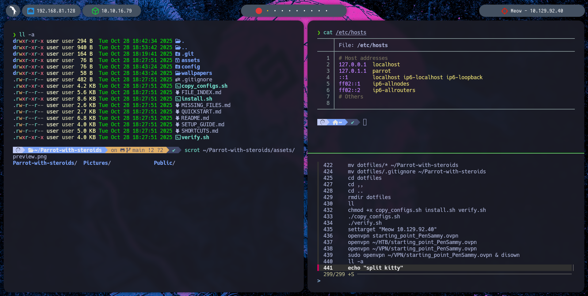

# 🚀 Dotfiles - Entorno BSPWM Personalizado para Parrot OS

Configuración completa y automatizada de mi entorno de trabajo basado en BSPWM para Parrot OS, optimizado para pentesting y productividad.



## 📋 Características

- **Window Manager**: BSPWM con configuración optimizada
- **Hotkeys**: SXHKD para atajos de teclado personalizados
- **Bar**: Polybar con módulos custom (IP local, VPN HTB, target)
- **Compositor**: Picom para transparencias y efectos
- **Launcher**: Rofi con tema personalizado
- **Terminal**: Kitty con configuración optimizada
- **Shell**: ZSH con Powerlevel10k
- **Editor**: Neovim con NvChad
- **Utilidades**: bat, lsd, feh

## 🎨 Módulos Personalizados de Polybar

### 1. **ethernet_status** - Muestra tu IP local
Script que detecta y muestra tu dirección IP de la interfaz de red activa.

### 2. **htb_ip** - IP de HackTheBox VPN
Muestra tu IP cuando estás conectado a la VPN de HackTheBox.

### 3. **target_hack** - Target de máquina
Muestra la IP de la máquina objetivo establecida con el comando `settarget`.

## 🛠️ Comandos ZSH Personalizados

### `settarget <IP>`
Establece la IP de la máquina objetivo que estás atacando. La IP se muestra en Polybar.

```bash
settarget 10.10.10.123
```

### `cleartarget`
Limpia el target establecido.

```bash
cleartarget
```

### `mkt <nombre_directorio>`
Crea una estructura de directorios para organizar tu trabajo en un CTF/máquina:

```bash
mkt maquina_htb
# Crea: maquina_htb/
#       ├── content
#       ├── exploits
#       ├── nmap
#       └── scripts
```

## 📦 Software Instalado

### Window Manager & Compositor
- **bspwm** - Window manager tiling
- **sxhkd** - Hotkey daemon
- **polybar** - Barra de estado
- **picom** - Compositor
- **rofi** - Launcher

### Terminal & Shell
- **kitty** - Terminal emulator
- **zsh** - Shell
- **powerlevel10k** - Tema de ZSH

### Utilidades
- **feh** - Wallpaper manager
- **bat** - Cat con syntax highlighting
- **lsd** - ls moderno
- **neovim** + **NvChad** - Editor

### Fuentes
- **Hack Nerd Font** - Fuente con iconos

## 🚀 Instalación Rápida

### 1. Clonar el repositorio

```bash
git clone https://github.com/iHakiu/Parrot-with-steroids.git ~/dotfiles
cd ~/dotfiles
```

### 2. Ejecutar el instalador

```bash
chmod +x install.sh
./install.sh
```

El script hará automáticamente:
- ✅ Backup de tus configuraciones actuales
- ✅ Instalación de todos los paquetes necesarios
- ✅ Instalación de Hack Nerd Font
- ✅ Instalación de Powerlevel10k
- ✅ Instalación de NvChad
- ✅ Copia de todas las configuraciones
- ✅ Configuración del wallpaper
- ✅ Cambio de shell a ZSH

### 3. Reiniciar sesión

Cierra sesión y vuelve a entrar. Selecciona **BSPWM** como tu window manager.

### 4. Configuración final

#### NvChad
Abre Neovim y ejecuta:
```vim
:MasonInstallAll
```

#### Powerlevel10k (opcional)
Si quieres reconfigurar el tema:
```bash
p10k configure
```

## ⌨️ Atajos de Teclado Principales

Los atajos están definidos en `~/.config/sxhkd/sxhkdrc`. Aquí algunos importantes:

| Atajo | Acción |
|-------|--------|
| `Super + Enter` | Abrir terminal (Kitty) |
| `Super + D` | Launcher (Rofi) |
| `Super + W` | Cerrar ventana |
| `Super + [1-9]` | Cambiar a workspace |
| `Super + Shift + [1-9]` | Mover ventana a workspace |
| `Super + Alt + R` | Reiniciar BSPWM |
| `Super + Alt + Q` | Salir de BSPWM |

📋 **[Ver lista completa de atajos →](SHORTCUTS.md)**

## 📁 Estructura del Repositorio

```
dotfiles/
├── install.sh                  # Script de instalación principal
├── README.md                   # Este archivo
├── config/
│   ├── bspwm/
│   │   ├── bspwmrc            # Configuración de BSPWM
│   │   └── scripts/           # Scripts personalizados
│   │       ├── ethernet_status.sh
│   │       ├── htb_ip.sh
│   │       └── target_hack.sh
│   ├── sxhkd/
│   │   └── sxhkdrc            # Atajos de teclado
│   ├── polybar/
│   │   ├── config.ini         # Configuración de Polybar
│   │   └── launch.sh          # Script de inicio
│   ├── picom/
│   │   └── picom.conf         # Configuración del compositor
│   ├── rofi/
│   │   └── config.rasi        # Tema de Rofi
│   ├── kitty/
│   │   └── kitty.conf         # Configuración de terminal
│   ├── nvim/                  # Configuración de NvChad
│   └── zsh/
│       ├── .zshrc             # Configuración de ZSH
│       └── .p10k.zsh          # Tema Powerlevel10k
├── wallpapers/
│   └── fondo.jpg              # Wallpaper principal
└── scripts/                   # Scripts auxiliares
```

## 🔧 Personalización

### Cambiar Wallpaper

Añade tu wallpaper en `~/fondos/` y modifica en `~/.config/bspwm/bspwmrc`:

```bash
feh --bg-fill ~/fondos/tu_wallpaper.jpg &
```

### Modificar Polybar

Edita `~/.config/polybar/config.ini` para cambiar módulos, colores, fuentes, etc.

### Ajustar Transparencias

Modifica `~/.config/picom/picom.conf` para ajustar las transparencias de las ventanas.

## ⚠️ Importante para Parrot OS

Este entorno está optimizado para **Parrot OS**. El script utiliza comandos específicos:

- ❌ **No uses** `apt upgrade` (puede romper el sistema)
- ✅ **Usa** `parrot-upgrade` para actualizar el sistema

## 🐛 Solución de Problemas

### Polybar no muestra módulos custom
```bash
chmod +x ~/.config/bspwm/scripts/*
```

### Fuentes no se muestran correctamente
```bash
fc-cache -fv
```

### Los atajos de teclado no funcionan
```bash
killall sxhkd
sxhkd &
```

### NvChad no carga correctamente
```bash
cd ~/.config/nvim
git pull
nvim
:MasonInstallAll
```

## 📸 Screenshots

### Vista Principal


### Capturas Adicionales

<details>
<summary>Click para ver más capturas 📷</summary>

### Polybar con Módulos Custom


### Rofi Launcher


### Terminal con Powerlevel10k


### Múltiples Workspaces


</details>

> **Nota:** Añade tus propias capturas en la carpeta `assets/screenshots/`. Lee [assets/README.md](assets/README.md) para más detalles.

## 🤝 Contribuciones

Si encuentras algún bug o quieres sugerir mejoras, siéntete libre de abrir un issue o pull request.

## 📄 Licencia

Este proyecto está bajo licencia MIT. Siéntete libre de usar, modificar y distribuir.

## 🙏 Créditos

- [BSPWM](https://github.com/baskerville/bspwm)
- [Polybar](https://github.com/polybar/polybar)
- [Powerlevel10k](https://github.com/romkatv/powerlevel10k)
- [NvChad](https://github.com/NvChad/NvChad)
- [Hack Nerd Font](https://github.com/ryanoasis/nerd-fonts)

---

**Hecho con ❤️ para la comunidad de Parrot OS**
